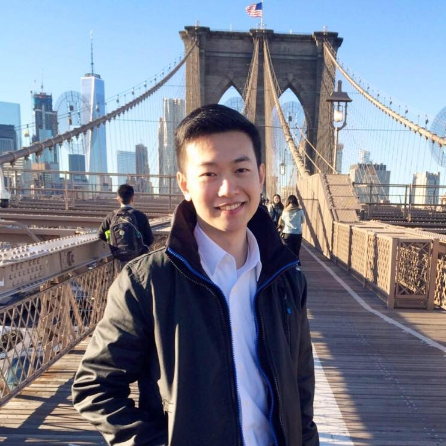

# Instructors

## Professor: Jonathan Conning

Received his PhD in Economics from [Yale University](https://economics.yale.edu/).  He has taught at Hunter College and The Graduate Center since 2002 and has also held full-time or visiting positions at Williams College, The University of Chile, Yale, Ozaka University, and The University of Cape Town, South Africa.  His research interests are trade, development, and political economy and the political economy of property rights and contracts. Born in New York but raised in Santiago, Chile. 

---

## Teaching Assistant: Yu Yun Chang

Yu-Yun Chang is a second year Ph.D. student at The CUNY Graduate Center's Economics program. Before joining the program, he worked as a financial analyst in the real estate field. His research interests include international economics and financial economics. Chang received his BA in Economics from the National Central University and his MS in Financial Engineering at NYU Tandon School. 

---

## Teaching Assistant Andrew J. Fox

Andrew J. Fox is a BA/MA student at Hunter. He's also aclassical bassonist by training...

