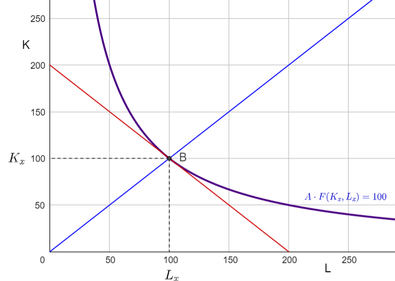
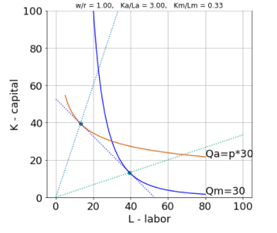

## Optimal Factor Intensity

<!-- unfinished from
https://app.tophat.com/e/054232/page/285843401 -->

Firms produce output using constant returns production technologies of the form **F(K,L)**. There are many combinations of capital **K** and labor **L** that can produce any given level of output **Q**. For example, if the firm has a Cobb-Douglas production function of the form 

$$Q=K^{\alpha} \cdot L^{1-\alpha}$$

​where $\alpha=\frac{1}{2}$ then to produce $Q=100$ they could choose any **production technique** (i.e. any combination of labor $L$ and capital $K$) along the $Q=100$ isoquant drawn below. 

They could produce $Q=100$ with a capital-intensive production technique (one that uses a lot of capital relative to labor) such as $(L,K)=(50,200)$, a more labor-intensive production technique such as $(L,K)=(200,50)$ or any of the other production techniques along that isoquant.  

Which combination will the firm want to choose?  That will depend on **relative factor prices** $\frac{w}{r}$ in the economy -- on how high wages are relative to rents.  If firms are in a high-wage country such as the United States then it will tend to be cheaper to produce any given level of output in a more capital-intensive manner (with relatively more capital and less labor) -- because capital is cheap relative to labor.  If however wages were to decline relative to rental rates then the firm would find it in their interest to switch to relatively more labor-intensive production methods. 

Consider two economies, call them Home and Foreign. The Home country is **capital abundant** and the Foreign country is **labor abundant**. We can express that this way:

$$\frac{\bar{K}}{\bar{L}}>\frac{\bar{K}^*}{\bar{L}^*}$$

Here $\bar{K}$ and $\bar{L}$ represent the endowment of capital and labor in the Home country and $\bar{K}^*$ and $\bar{L}^*$ represent endowments in the foreign country. 

If the two countries have access to the same Production Technology the above will imply that (when the two countries are closed to trade and factor movements between one another) the Home country will have higher wages relative to rents.  Intuitively, in the home country each worker has more capital to work with compared to workers in the foreign country, so the home workers will be more productive and earn higher wages.

To maximize profits, competitive firms (in any sector) will want to find the lowest cost combination of labor and capital to produce any given level of output.  Suppose we have firms in the X sector of the home country.  They cost-minimization problem can be thought of this way:

 $$\max_{K_x,L_x} w\cdot L_x+r\ldot L_x$$

 subject to:

$$F(L_x,K_x)=100$$

The firm would like to know the total cost of every production technique (combination of labor and capital), given prevailing wages and rents, and then choose the lowest cost technique. Suppose  $w=1$ and $r=1$ and the wage rental ratio is therefore $\frac{w}{r}=1$. With a Cobb-Douglas production function as above where $F(K,L)=K^{\alpha}L^{1-\alpha}$ and $\alpha=\frac{1}{2}$ the firm could produce using $(L,K)=(50,200)$ at a cost of 

$$TC=wL+rK=1\cdot 50 + 1\cdot 200 = 250$$

If instead it produced the same $Q=100Q=100$ using $(L,K)=(100,100)$ then the total cost would be 

$$TC=wL+rK=1\cdot 100 + 1\cdot 100 = 200$$

which is clearly less.  Hence, for these wages and rental rates this is the more efficient, cost-minimizing, production technique.  The diagram below we depicts this second choice

The downward sloping red line is the $TC=200$ **isocost** line. For any given level of total cost **TC** and factor prices $w,r$ we can define an iso-cost line (equal cost line) that tells us the combinations of labor and capital we can purchase at total cost **TC**.  The isocost line is given by $TC=r\cdot K + w\cdot L$ which we can re-arrange in a way that is easy to graph:

$$K=\frac{TC}{r}-\frac{w}{r}\cdot L$$

There are different possible iso-cost lines, one for each level of cost. The slope of any given isocost line is given by negative $\frac{w}{r}$   

In the interactive diagram below (source: https://www.geogebra.org/classic/zfdxf6gj) you can change the wage-rental ratio (choose 'choice' checkbox and then move the slider labeled wr) to see how the cost minimizing choice of technique will vary.

**GEOGEBRA THING HERE**

Notice that if you change from a $Q=100$ to a $Q=150$ isoquant, the optimal ratio $\frac{K_x}{L_x}$ does not change and is only affected by the wage-rental ratio $\frac{w}{r}$. So for any given $\frac{w}{r}$ ratio we have an associated optimal capital intensity in production $\frac{K_x}{L_x}$. This is indicated by the blue line line starting from the origin which has slope $\frac{K_x}{L_x}$. 

**Slightly more advanced**: We can derive an expression summarizing the relationship between the wage rental ratio and optimal capital intensity.  Firms maximizing profits (minimizing costs) will hire labor until the marginal value product of the last hour of labor hired is equal to the market wage:

$$w=MPL(K_x,L_x)$$

and hire capital until the marginal value product of the last hour of capital hired is equal to the market rental rate:

$$r=MPK(K_x,L_x)$$

If we take the ratio of these two expressions we get:

$$\frac{w}{r}=\frac{MPL(K_x,L_x)}{MPK(K_x,L_x)}$$

If you look at the diagram you see the optimal production technique **B** was found at the tangency between an isocost line which has slope equal to negative $\frac{w}{r}$ and an isoquant which has slope (or marginal rate of technical substitution) equal to negative $\frac{MPL(K_x,L_x)}{MPK(K_x,L_x)}$, so the condition above simply indicates we are at a tangency.

With a Cobb-Douglas technology of the form $F(K,L)=K^{\alpha}L^{1-\alpha}$ we can find $MPL=(1-\alpha)\frac{F(K,L)}{L}$ and $MPK=\alpha\frac{F(K,L)}{K}$ and hence the tangency condition becomes:

$$\frac{w}{r}=\frac{1-\alpha}{\alpha}\frac{K_x}{L_x}$$

Which then leads us to an expression for optimal capital intensity as a function of the wage-rental:

$$\frac{K_x}{L_x}=\frac{\alpha}{1-\alpha}\frac{w}{r}$$

which is what is graphed as the blue line in the figure.

## Factor Intensity

The parameter $\alpha$ is the capital share.  It tells us how capital or labor intensive production is. When $\alpha$ is high firms will choose relatively more capital-intensive production techniques at any given wage rental. Some production activities, say steel production, are capital-intensive production technologies. They tend to require high levels of capital per worker at any level of $\frac{w}{r}$ compared to other technologies.  Other production activities, saylight-manufacturing or many service sector activities, tend to be more labor-intensive. 

You can see how the $\alpha$ capital-share parameter changes the shape and position of isoquants. Using the interactive widget above, start with a low $\alpha$ (to represent a labor-intensive production function) and then -- keeping the wage rental ratio $\frac{w}{r}$ in the economy fixed) slowly raise its value and see how with more labor-intensive production technologies, more labor-intensive production techniques get adopted.

**r Diagram** below we depict an economy that produces agricultural goods and manufacturing goods. We've drawn the $Q_m=30$ isoquant and a $Q_a=30$ isoquant (because $p=1$). In this economy the wage-rental ratio is $\frac{w}{r}=1$ and we can see the lowest-cost production technique in the $X$ sector at the tangency between an isocost line with slope $-\frac{w}{r}$ and the $Q_m=30$ isoquant. 

The firms are led to maximize profits by using production techniques that use $\frac{K_m}{L_m}$ units of capital per unit of labor.  If we compare that to the production techniques chosen by firms in the agricultural sector that face the same wage-rental ratio, they choose production techniques that use $\frac{K_a}{L_a}$ units of capital per unit of labor. Since $$\frac{K_a}{L_a}>\frac{K_m}{L_m}$$ we can see that agriculture is more capital-intensive than manufacturing.

Note that an isocost line is given by 

$$TC=w\cdot L+r\cdot K$$

which is graphed as 

$$K=\frac{TC}{r}-\frac{w}{r}\cdot L$$

Suppose the price of good $X$ is $P_x=\$1$ per unit. Then, in a competitive equilibrium where firms are forced to price at average cost (i.e. zero profits) then it should cost $30 to produce $Q_x=30$. In the diagram above we have drawn the $TC=30$ isocost line running through the tangency. 

Notice that as we've drawn it the same isocost line also touches the $Q_a=30$ isoquant so it must also cost $30 to produce that quantity. This also means that the relative price of good M in terms of good A $p=\frac{p_m}{p_a}$ must equal $p=1$ since 30 units of good M exchange for 30 units of good A. 

​

