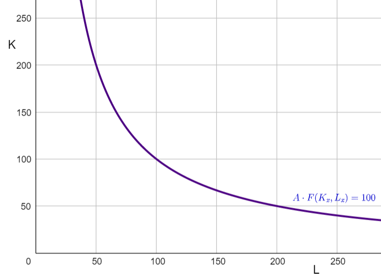

## Optimal Factor Intensity

<!-- unfinished from
https://app.tophat.com/e/054232/page/285843401 -->

Firms produce output using constant returns production technologies of the form **F(K,L)**. There are many combinations of capital **K** and labor **L** that can produce any given level of output **Q**. For example, if the firm has a Cobb-Douglas production function of the form 

$$Q=K^{\alpha} \cdot L^{1-\alpha}$$

​where $\alpha=\frac{1}{2}$ then to produce $Q=100$ they could choose any **production technique** (i.e. any combination of labor $L$ and capital $K$) along the $Q=100$ isoquant drawn below. 

They could produce $Q=100$ with a capital-intensive production technique (one that uses a lot of capital relative to labor) such as $(L,K)=(50,200)$, a more labor-intensive production technique such as $(L,K)=(200,50)$ or any of the other production techniques along that isoquant.  

Which combination will the firm want to choose?  That will depend on **relative factor prices** $\frac{w}{r}$ in the economy -- on how high wages are relative to rents.  If firms are in a high-wage country such as the United States then it will tend to be cheaper to produce any given level of output in a more capital-intensive manner (with relatively more capital and less labor) -- because capital is cheap relative to labor.  If however wages were to decline relative to rental rates then the firm would find it in their interest to switch to relatively more labor-intensive production methods. 

Consider two economies, call them Home and Foreign. The Home country is **capital abundant** and the Foreign country is **labor abundant**. We can express that this way:

$$\frac{\bar{K}}{\bar{L}}>\frac{\bar{K}^*}{\bar{L}^*}$$

Here $\bar{K}$ and $\bar{L}$ represent the endowment of capital and labor in the Home country and $\bar{K}^*$ and $\bar{L}^*$ represent endowments in the foreign country. 

If the two countries have access to the same Production Technology the above will imply that (when the two countries are closed to trade and factor movements between one another) the Home country will have higher wages relative to rents.  Intuitively, in the home country each worker has more capital to work with compared to workers in the foreign country, so the home workers will be more productive and earn higher wages.

To maximize profits, competitive firms (in any sector) will want to find the lowest cost combination of labor and capital to produce any given level of output.  Suppose we have firms in the X sector of the home country.  They cost-minimization problem can be thought of this way:

 $$\max_{K_x,L_x} w\cdot L_x+r\ldot L_x$$

 subject to:

$$F(L_x,K_x)=100$$

The firm would like to know the total cost of every production technique (combination of labor and capital), given prevailing wages and rents, and then choose the lowest cost technique. Suppose  $w=1$ and $r=1$ and the wage rental ratio is therefore $\frac{w}{r}=1$. With a Cobb-Douglas production function as above where $F(K,L)=K^{\alpha}L^{1-\alpha}$ and $\alpha=\frac{1}{2}$ the firm could produce using $(L,K)=(50,200)$ at a cost of 

$$TC=wL+rK=1\cdot 50 + 1\cdot 200 = 250$$

​

