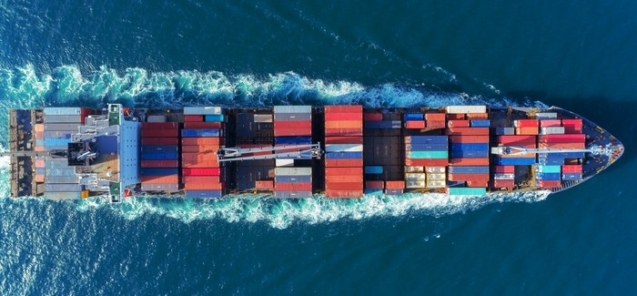

# Welcome

Welcome to our Spring 2021 Economics 340: International Trade class at Hunter College.  I look forward to a terrific semester together. 

International Trade has always been one of my favorite classes.  As I'll soon try to convince you,  the analysis and effects of engaging in "trade" are very similar to the adoption a new 'technology.'  This then is really a class about how technology, trade, the movement of factors of production such as labor and capital transform the world, change  the income distribution, and impact peoples lives.  

In order to hope to understand these processes we'll have to dig not just into economists' micro- and macro- model toolkits but also consider these issues in the context of economic history, political economy, and politics. This is inescapable because the policies that societies adopt to shape the nature and pace of trade and technology will always be ultimately shaped by how the benefits to one group are weighted against the costs to another, and whether and how politics and institutions allow one group to compensate the other, or not.  This is determined by social, political, and market processes.  

Technological innovation, gains to greater specialization and trade, and the more easy flow of people, ideas and investment across borders have all certainly contributed to periods of rising standards of living across the world.  But these processes can and have also been at times profoundly disruptive, and at times opposed.  Change creates winners and losers and people will organize to  support or challenge these policies.  

Globalization picked up steam following a worldwide wave of trade liberalization starting around the 1980s. Labor abundant countries such as China, India which had previously been relatively outside the global trading system, emerged as powerful new exporters.  New digital and industrial technologies created new manufacturing and service industries.  Combined, these forces greatly expanded the flow of goods, services, capital and people across borders. New global supply chains emerged as large firms restructured and relocated production across borders.  Immigration flows increased. Hundreds of millions of people were lifted out of poverty around the world during this period, partly as a result of the new opportunities and reallocations created by these new trading patterns and technological change. The income distribution and politics in the richer countries also became affected however, and some observers have described the recent rise of new nationalist and populist political movements in Europe, the United States, and other countries as being driven, at least in part, by a 'backlash' against globalization. Yet it's too early to really tell.  While in recent years some countries such as the United States became somewhat more trade protectionist, tightened their immigration policies and pulled out of multilateral cooperation agreements such as the Paris Accords on climate change, other countries and regions have kept up the pace of liberalization, signing new trade and investment pacts.   A new administration in Washington may change the course on some of these policies yet  debates over these issues will rage on.   

These are only some of topics and themes we will cover in the course.  We'll do our best to discuss trade economics in the news.  

Explore the site, follow the news, and come to class prepared to discuss. 

You'll find materials in tophat pages, sometimes organized in module folders.  We've made a lot of changes to the course for this semester.  The most notable change is that there is no assigned textbook. You'll learn the content instead from the Content pages we create and the slides and videos and lectures you attend.  Not having a textbook will save you a good $60 (you will have to pay $30 for Tophat but the commercial textbook bundle alternatives we've used in the past cost $100 and up.    
