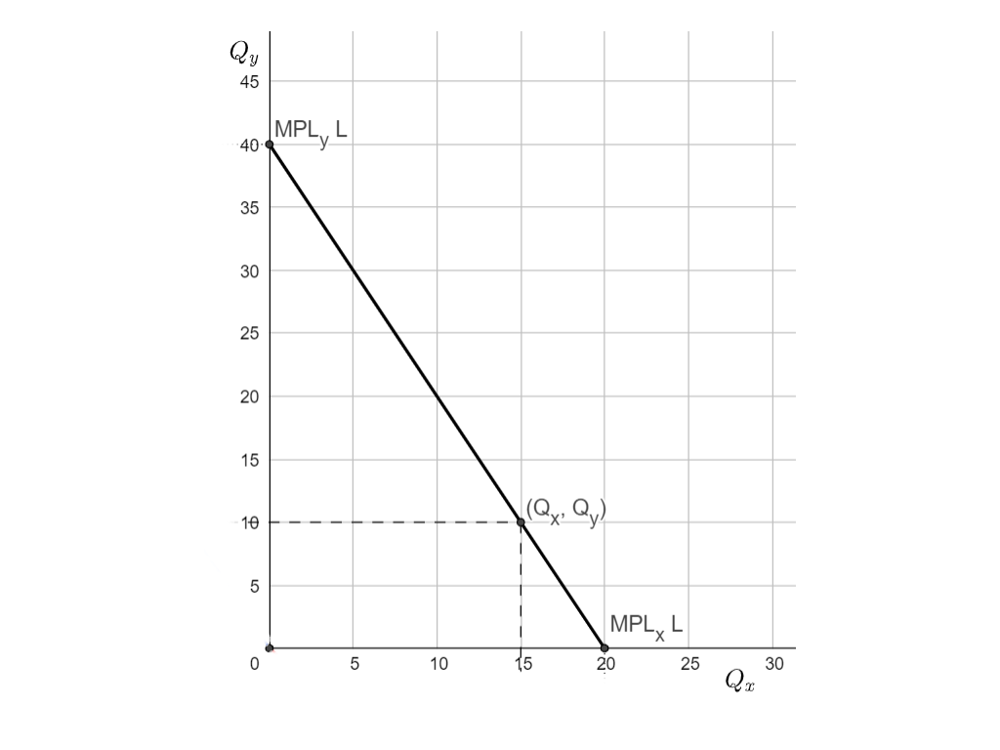

# p_The_Ricardian_Model

>The mathematician Stanislaw Ulam did not have a high opinion of the social sciences. He once challenged Paul Samuelson, Nobel laureate in economics, to name just one social science proposition that was both true and non-trivial.  [Samuelson](http://mitpress.mit.edu/catalog/item/default.asp?ttype=2&tid=8399) nominated comparative advantage: 
>
>“*That this idea is logically true need not be argued before a mathematician; that it is not trivial is attested by the thousands of important and intelligent men who have never been able to grasp the doctrine for themselves or to believe it after it was explained to them.”*[^quote]

The Ricardian Trade Model, is one the earliest worked-out modern models of trade based on the idea of **comparative** (or relative cost) **advantage**.  It is due to its namesake David Ricardo (1772-1823), one of the most influential of the Classical Economists (alongside Adam Smith, Thomas Malthus, and Karl Marx) .  Ricardo is famous not just for his economic theory of comparative advantage, but also for his labor theory of value, and theory of rent.  We can learn about each of these ideas here.


David Ricardo[^1]

David Ricardo was, by all accounts, [a brilliant and interesting character](https://en.wikipedia.org/wiki/David_Ricardo):  the son of Portuguese Jews he was disowned by his family for converting to Unitarianism, but nonetheless became very wealthy at a young age by making a large stock-market bet on the outcome of the Battle of Waterloo. A close friend of leading Political economists of the day Thomas Malthus and Jeremy Bentham, he became a member of the British Parliament where he became a champion of several Liberal causes  (capital "L") including expanding political representation, the abolition of slavery, and free trade.  

In Ricardo's times the idea of free trade between countries was seen as radical. Most regions of the world, including Britain, followed mercantilist trade policies which aimed to maximize a country's trade surplus, by trying to monopolize trade routes or by imposing high tariffs and other trade restrictions on imported goods.  Britain's Parliament, which was at the time still dominated by Aristocratic agrarian interests and landlords, maintained "Corn Laws" in place that imposed heavy restrictions on the importation of grains from abroad ("Corn" was the term for grains of all sorts) .  David Ricardo, who was more aligned with the rising urban manufacturing and financial groups associated with the Industrial revolution, became a fierce critic of the landed aristocracy and the Corn Laws which he saw as a mechanism to raise land rents that only lowered aggregate national income and depressed workers wages and industrialists' profits.  His theory of comparative advantage sought to demonstrate that England and the rest of the world could both gain by each specializing at the production of those goods that they each produced at comparatively lower cost, and then trade with one another.  In his most famous examples, he argued that England should specialize in the production and export of manufactured goods such as Cloth, while the rest of Europe -- often represented by Portugal -- should specialize and export in the production of agricultural goods (Wine). 

The gains to trade from comparative advantage argument argues, in a nutshell, is that if each of us specializes at producing those things that we can produce at lower opportunity cost, then the world will save on costs:  we will get more output from the same inputs, and therefore we should in principle be in a position to all gain.  

The principle is simple to demonstrate in an 'irrefutable' model, yet, as the opening quote suggests, it's an idea that many people nonetheless fail to grasp (for a deeper take see Paul Krugman's other provocative essay, "[Ricardo's Difficult Idea](http://web.mit.edu/krugman/www/ricardo.htm)").  

Another reason for this resistance perhaps is that while most more realistic models demonstrate how trade expands national income in both trading countries, they also demonstrate how it creates winners and losers, and while the winners could monetarily more than compensate the losers, that would require political redistribution mechanisms that may be difficult to create and sustain. We often also tend to see the effects of trade through the eyes of those who stand to lose, who sometimes organize better politically or speak out more loudly than those that stand to gain.   Despite Ricardo's best efforts, the British Corn Laws which protected the interests of British landlords who were well represented in Parliament, were not abolished until well after his death.  

Ricardo was clever enough to formulate his model in a very framework with only labor as a factor of production.  This helps to make sure that the gains to trade are broadly shared: opening to trade will raise national income and real wages in each country, and since everyone is a worker, everyone gains.


## The PPF: Transforming one good into another via domestic technology

All we need to build the linear **Production Possibilities Frontier** that is used to fully describe the supply side of the Ricardian model is a description of the production technology in each sector and the labor resource constraint.
$$
\begin{aligned}
Q_x &= MPL_x \cdot L_x  \\
Q_y &= MPL_y \cdot L_y   \\
\bar L &= L_x + L_y 
\end{aligned}
$$

Let's get concrete.  Suppose our Home economy has $\bar L=20$ workers and production technology in each sector as follows

|          |        $MPL_x$         |        $MPL_y$         |
| -------: | :--------------------: | :--------------------: |
| **Home** | 1 unit of X per worker | 1 unit of Y per worker |

As we've seen before, the easy way to draw the PPF is to first find the two possible points of specialization and then draw a straight line between them.  If Home country placed all of its workers into X production it would produce the production bundle $(Q_x, Q_y)=(20,0)$ , since  those 20 units of labor would produce $Q_x=MPL_x\cdot \bar L=1 \cdot 20=20$ units of good X and with no labor remaining to produce good Y, it produces zero units of good Y.   By similar reasoning, if the country put all 20 units of labor into the production of good Y it would produce the bundle $(Q_x, Q_y)=(0,40)$ , since  those 20 units of labor would produce $Q_y=MPL_x\cdot \bar L=2 \cdot 20=40$ units of Y.



We can also easily calculate the opportunity cost of producing one more unit of X measured in terms of good Y.  The simplest way to think of this is to imagine we start out specialized with all labor in Y production and we decide to switch *all*  the labor from good Y into good X.  We'd have to give up producing all 40 units of Y to release the 20 units of labor that will then produce 20 units of X.  In other words we've given up 
$$
\frac{40}{20} \left( \frac{\text{ units of Y}}{\text{ units of X}} \right )
=2 \left( \frac{\text{ units of Y}}{\text{ units of X}} \right )
$$

We had to give up two units of Y per each unit of X, so we say the **opportunity cost** of producing one more unit of X is the 2 units of Y we have to give up to release the labor we need.

More generally we give up $MPL_y\cdot \bar L$ units of Y for $MPL_x\cdot \bar L$ units of X, or
$$
\frac{MPL_y}{MPL_x}\cdot \frac{\bar L}{\bar L}
= \frac{MPL_y}{MPL_x} \left(\frac{\text{units of Y}}{\text{unit of X}}  \right)
$$
So the opportunity cost of producing one more unit of X is $\frac{MPL_y}{MPL_x}$ units of Y. 

(To be precise, we should have written this as $-\frac{MPL_y}{MPL_x}$ to reflect that we give up output of Y to release labor to make more X -- the slope of the PPF is negative.  However, since we are using verbal language to indicate that we mean output that we give up, we won't indicate the negative sign in the expressions)

Notice that this opportunity cost depends entirely on state of domestic technology -- on the marginal products of labor in the two production functions.  Economists often refer to this ratio -- to the slope of the production function -- as the **marginal rate of transformation (MRT)**.  It tells us the rate at which we can transform Y goods into X goods, using only domestic technology.

Let's talk our way through the derivation of this opportunity cost again, in a similar but slightly different way. Because productivity is such that 1 worker produces $MPL_x=1$ units of good X, we can conclude that $1/MPL_x$ tells us how many workers we need to produce each 1 unit of X.  This is also known as the **unit labor requirement ** and labeled
$$
a_{Lx}=\frac{1}{MPL_x}=1 \left (\frac{\text{workers}}{\text{unit of X}} \right)
$$

```question
1. RMM121 In the Y sector each worker can produce $MPL_y=2$ units of Y. How many workers are needed to produce one unit of Y in that sector?
a. 2 workers
b. 1 worker
*c. 1/2 a worker
```

Suppose we start from an allocation with $L_x=15$ workers to the X sector. These workers can produce up to  $Q_x=15$ units of X output.  That leaves us $L_y=5$ workers to allocate to the Y sector where they can make up to  $Q_y=2\cdot5=10$ units of good Y.  We plot that production bundle  $(Q_x, Q_y)=(15,10)$  on the PPF above.

Suppose we now want to increase output of good X by one unit, from 15 to 16 units.  To produce 1 more unit of X we need $\frac{1}{MPL_x}=1$ worker.  Since all 20 workers were fully employed the only way to get that one additional worker is to pull them out of production in the Y sector where they would have produced $MPL_y=2$ units of good Y.  Hence the opportunity cost of producing one more unit of X is given by the:
$$
\frac{1}{MPL_x}  \cdot MPL_y
$$

units of good Y per unit of X we have to give up, the same opportunity cost we previously calculated.  

```question
1.RMM122 Suppose we had an economy where a worker can produce $MPL_c=30$ caramel candies per hour.  Hence if $L_c$ hours of labor are dedicated to caramel production, a total of $Q_c = MPL_c \cdot L_c$ caramels will be produced. 

If you wanted to produce 270 caramels, ________ hours of labor would be required? 

Numeric answer: 9.0
```

 

### Market Prices in The Closed Economy

Let's assume perfect competition in the market for goods and labor.  Define $P_x$, $P_y$ and $w$ as the competitively determined prices of good X, of good Y, and the worker wage, each of them measured in nominal units (such as US\$ per  good or per worker).  

Free entry and competition will guarantee that firms will compete in the market for products and labor until there are zero profits, at which point firms will sell at Price equal to average cost in each sector.  This will guarantee that prices for each good are equal to:
$$
P_x = w\cdot \frac{1}{MPL_x}  
\\
P_y = w\cdot \frac{1}{MPL_y}
$$
To see this, recall that to produce one unit of good X a firm will need $\frac{1}{MPL_x}$ workers and each of those workers must be paid the market wage $w$. So the average (and marginal) cost of producing one unit of good X is as above, and competition forces firms to set average cost equal to price. 

Now take the ratio of $P_x$ to $P_y$ from above (notice that the wage terms $w$ cancel out) to find:
$$
\frac{P_x}{P_y}=\frac{MPL_y}{MPL_x}  \left ( \frac{\text{units of good Y}}{\text{unit of good X}}  \right)
$$

This is the closed economy market **relative price of good X**, measured in terms units of good Y, exactly the same opportunity cost given by the marginal rate of transformation (MRT).   

What about prices and wages measured in nominal terms, i.e. measured in currency?   This turns out to be a question that we really cannot answer without knowing something about how of which type of currency is circulating.  Is it pesos, or dollars, or rand?  It turns out not to really matter for our purposes however, so it's not an interesting question.  All that matters for determining real allocations in this economy are real relative prices, that is to say,  prices that can be measured in terms of one of the goods.  When we write $\frac{P_x}{P_y}$ we are measuring the price of good X in terms of how many units of good Y trade for it on the market.  Had we instead $\frac{P_y}{P_x}$ that would be the relative price of good Y, measured in terms of good X.

```question
1. RMM222 If the relative price of good D is $\frac{P_d}{P_c}=3$ units of good C per unit of good D, what is $\frac{P_c}{P_d}$?

a. 3 units of good D per unit of good C
*b. 1/3 of a unit of good D per unit of good C
d. 1/3 unit of good C per unit of good D
```

###  Real Wages in the Closed Economy


[TOC]

## The Ricardian Model

We will explain more intuitively below but,  in essence, all we need to describe the supply side of the Ricardian model (all we need to build the PPF) is a description of the production technology in each sector and the labor resource constraint.
$$
\begin{aligned}
Q_x &= MPL_x \cdot L_x  \\
Q_y &= MPL_y \cdot L_y   \\
\bar L &= L_x + L_y 
\end{aligned}
$$

We also need to specify Consumer Preferences (the Demand Side).  We'll be a bit more va

We can analyze resource allocations in the Ricardian Economy as might be chosen by a Social Planner or, alternatively, as if the allocations were 


## Preliminary

The econS

Consider an economy with just two goods.  If this is an economy is in **autarky** or closed to trade then that country will have to produce everything that it wants to consume.  If consumers as a group want to consume consumption bundle $(C_x, C_y)$ they must produce exactly that much of each good, in other words $C_x=Q_x$ and $C_y=Q_y$.


### Budget Constraints


Production Possibility Fr


## Transforming one good into others


### With Technology

With Technology and Trade

### The Domestic PPF


#### Real Wages


### Absolute versus Comparative Advantage

### Gains to Trade


Through technology


**Notes**

[^quote]: [Comparative Advantage: Doing what you do best](tp://oecdinsights.org/2011/10/11/comparative-advantage-doing-what-you-do-best/#:~:text=Samuelson%20nominated%20comparative%20advantage%3A%20%E2%80%9CThat,it%20was%20explained%20to%20them.%E2%80%9D)
[^1]: [Ricardo's portrait](https://www.d.umn.edu/cla/faculty/jhamlin/4111/Ricardo/David%20Ricardo.htm).

|                                      |                                     |
| :----------------------------------: | :---------------------------------: |
| **IV:  <br />$Q_x=MPL_x \cdot L_x$** |          **I: <br />PPF**           |
|   **III: <br />$L_x+L_y=\bar L$**    | **II: <br />$Q_x=MPL_x \cdot L_x$** |

