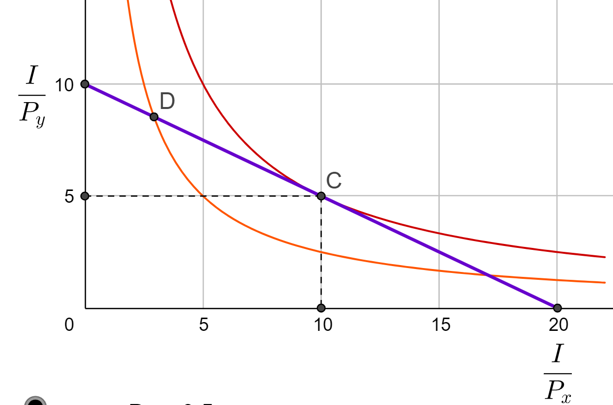
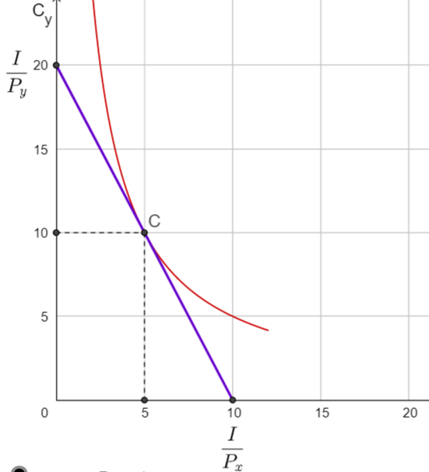

# Consumer Preferences and Indifference Curves

You have probably learned about 'consumer choice' in other classes. If not the following will be a very quick introduction.   We need just enough to learn how to draw and interpret budget constraints as well as indifference curves as a representation of consumer demands.

## Budget constraint

A consumer with monetary income $I$ (measured in dollars) can purchase goods at market prices $P_x$ and $P_y$ (measured in dollars per unit of the good).  The consumers' budget constraint is:

$$
p_x \cdot C_x + p_y \cdot C_y \le I
$$

To be feasible, any consumption bundle $(C_x,C_y)$ the sum of what the consumer spends on good X ($P_x \cdot C_x$) plus what they spend on good Y  ($P_y \cdot C_y$) cannot be more than available income $I$.   Since we'll generally assume that the consumer always prefers more of each good to less (and, for now, no saving or borrowing across time periods) the budget constraint will 'bind' or hold as an equality.  If we wanted to graph this with $C_x$ on the horizontal and $C_y$ on the vertical, we could re-arrange the (binding) budget set as:

$$
C_y = \frac{I}{P_y}-\frac{P_x}{P_y}\cdot C_x
$$

Note that this has vertical intercept $I/P_y$ is the maximum amount of Good Y the consumer could buy if they set $C_x=0$ and spent all income on just purchasing Good Y.  The X-axis intercept $I/Px$ is  the maximum amount of good X the consumer could buy if they set $C_y=0$, and spent all income on just purchasing good X.  The consumer's budget constraint is by drawing a straight line connecting these points.

The slope of the budget line $\frac{P_x}{P_y}$ tells us the relative price of good X measured in terms of good Y, or how many units of good Y the consumer must cut back on to release the money needed to buy one more unit of good X.    

<iframe scrolling="yes"
src="https://www.geogebra.org/material/iframe/id/r9mg5txp/width/800/height/600/border/888888/rc/false/ai/false/sdz/false/smb/false/stb/false/stbh/true/ld/false/sri/true/at/preferhtml5"
width="500px"
height="400px"
style="border:0px;">
</iframe>

## The Consumer's Utility Maximization Problem

The consumer's preferences can be represented by a cardinal utility function $U$ overs consumption bundles.  The consumer wants to choose a consumption bundle $(C_x, C_y)$ so as to maximize utility amongst those bundles that are feasible given their budget constraint.  We write this as the constrained optimization problem:

$$
\max_{C_x, C_y} \ \ U(C_x,C_y)  \\

s.t. \ \ \ \ p_x \cdot C_x+p_y \cdot C_y = I
$$

Suppose the consumer's preferences were summarized by the simple utility function:

$$
U(C_x,C_y) = C_x \cdot C_y
$$

This displays some commonly assumed properties.  For example the consumer's utility or satisfaction rises with $C_x$ and $C_y$ and they're never satiated.  Call this the 'more is better than less assumption.' 

<iframe width="560" height="315" src="https://www.youtube.com/embed/TcUwR9KERlA" frameborder="0" allow="accelerometer; autoplay; clipboard-write; encrypted-media; gyroscope; picture-in-picture" allowfullscreen></iframe>

## Indifference Curves

The two goods are also substitutes in consumption. Suppose for example that the consumer were offered the bundle $(C_x,C_y)=(5,10)$. They would get utility satisfaction $U(5,10)=50$ utils.  If we took away 5 units of good Y, the consumer would obviously be made worse off, but if we compensated the 5 more units of good X in return, they'd end up at a new consumption point $(C_x,C_y)=(10,5)$ which would give them the same level of utility (50 utils).  

 In the diagram below you'll see two **indifference curves**.  All the consumption bundles on a given indifference curve  give the consumer the same level of utility.  For example all the points on the indifference curve passing through consumption bundle **D** give the consumer a total utility of 25 utils.  All the consumption bundles passing through point **C** give the consumers utility of 50 utils, and so forth. Indifference curves are just like the contour lines on an elevation map, curves further out to the north east give higher utility), and in fact we say the diagram displays an indifference map that represents consumer preferences.   We obviously haven't drawn them all in, but choose any consumption point at random and you can draw an indifference curve passing through that point. 

Indifference curves can never cross (otherwise there would be two separate levels of utility associated with the bundle at which they cross, a contradiction) and we will make assumptions about preferences to guarantees that indifference curves always slope down.  The slope of an indifference curve at any given consumption bundle, is called the **marginal rate of substitution**: it tells us the psychic rate of tradeoff that leaves the consumer indifferent between two bundles: how much of good Y the consumer would be willing to give up in order to get one more unit of good X. 

We'll also make assumptions to guarantee that indifference curves display **diminishing marginal rate of substitution.** Look at the indifference curve passing through bundle D again. At bundle D the consumer has quite a lot of Y and not much of good X, so the slope of the indifference curve at point D is quite steep, reflecting the fact that the consumer is willing to give up quite a lot of good Y (which they have in abundance) for one more unit of good X (which they don't have much of yet).  Note however that as we move the consumer along that indifference curve, say to the bundle where indifference curve cuts the budget line from below, the consumer now has much more of good X and less of good Y.  The consumer's marginal tradeoffs are now different, they will be willing to give up only very little of good Y for good X.  In other words as we move down along a consumer indifference curve the consumer becomes willing to pay less and less units of Y for an additional unit of X.

 

How to find the consumer optimum?   Since we said 'more is better than less' we know the consumer will choose a point along their budget line (they get no utility from leaving money unspent).  So suppose we start with the wild guess and speculate that point **D** is their optimal.  Can the consumer raise utility by giving up a bit of good Y in exchange for another unit of good X?  From the diagram we see that the answer is yes. If we have the consumer rearrange their budget so as to purchase and consume one more unit of X, which on the market they can do for $\frac{P_x}{P_y}=\frac{1}{2}$ a unit of Y, they move along the budget line to a new point (between D and C) which will place the consumer on a higher indifference curve.  If we keep on making small adjustments like this we'll keep on moving the consumer along their budget line until they get to point C, at which point there are no further marginal adjustments that can take them to a higher indifference curve.  Hence consumption bundle **C** which is  on the highest indifference curve that is still touching the budget line (or, equivalently, at a point where the slope of the indifference curve is exactly tangent to the slope of the budget curve) gives the consumer highest utility, consistent with that income and market prices.

## Community Indifference Curves

Indifference curves are useful because they give us a visual representation of consumer preferences.  Typically in trade models we'll start out by drawing a production possibility frontier.  In a closed economy, this will is also be the country's budget set, or what we will call the **consumption possibility frontier** (CPF) or national income line.   We'll typically then quickly identify an optimum consumption point along this CPF by finding the highest **community indifference curve** that just touches the CPF, such as point C in the diagram below. 

An indifference curve is easy to define and conceptualize when it comes to a single individual.  But what's a community indifference curve?  Loosely speaking, a community Indifference Curve that corresponds to a Social Welfare function, which you can think of as a weighted sum of the utility functions of all the consumers in the economy.  For various reasons, this is a somewhat problematic concept -- how to make interpersonal utility comparisons, how much weight does/should each consumer's utility get, etc. We'll get into a deeper discussion of these issues in later sections, but for the meantime, we'll treat community indifference curves as if they behaved just like individual indifference curves.

[^Comment]:  Text that will not appear in html source

[^comment]: this is the foot
