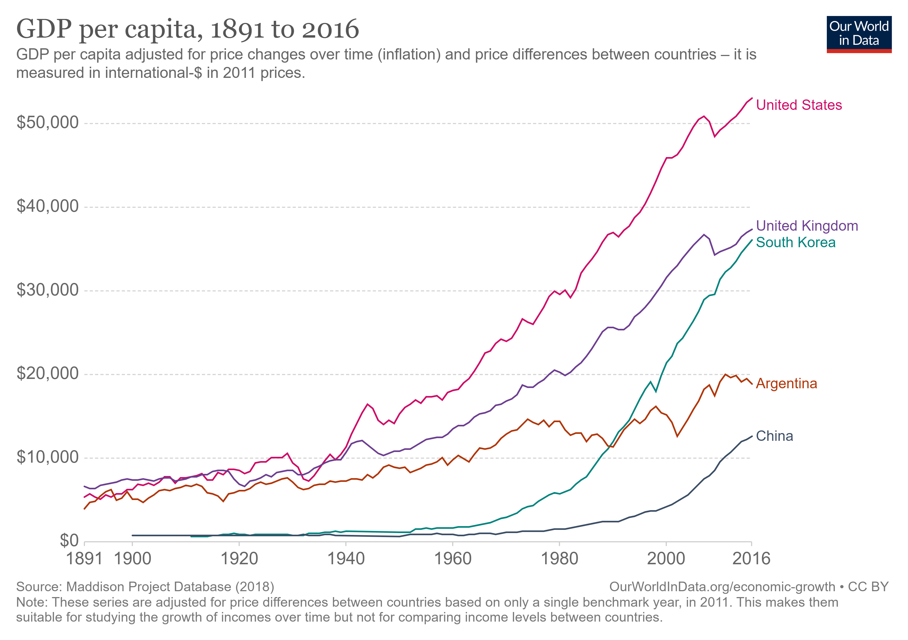

# Production Technologies

<iframe src="https://ourworldindata.org/grapher/capital-intensity?country=~USA" loading="lazy" style="width: 100%; height: 600px; border: 0px none;"></iframe>
source: OWID Capital Intensity 

<iframe src="https://ourworldindata.org/grapher/capital-intensity?country=USA~GBR~JPN~ARG~MEX" loading="lazy" style="width: 100%; height: 600px; border: 0px none;"></iframe>

Compare the trajectory to other countries.

GDP per capita

