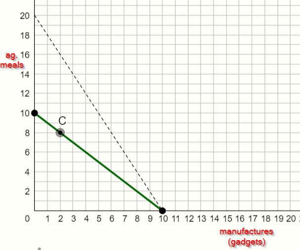

# p_Read Krugman

## Read Krugman's "In Praise of Cheap Labor"

Please read [Paul Krugman's "In Praise of Cheap Labor," Slate March 21 1997](https://slate.com/business/1997/03/in-praise-of-cheap-labor.html) and then return to answer the questions below.

RSM104

RSW101

RSW102

Consider the following simple Ricardian model representation of the Philippines economy which Paul Krugman has described (circa 1980s).  Suppose there are just two sectors "manufacturing" and "agriculture" (which we might extend to include harvesting garbage from 'Smokey Mountain'). Worker productivity is low in both sectors. 

Suppose that in the closed economy 80 percent of the labor force is in agriculture.  The economy has $L=10$ million daily workers and the daily production possibility frontier for the economy looks like this, with daily national consumption at a point such as **C** with 8 million meals and 2 million gadgets produced.  

RMN109.png

 Type caption for image (optional)
Suppose that in the closed economy 80 percent of the labor force is in agriculture.  The economy has \bar L = 10 
L
ˉSince this is a closed economy, point CC is both the production bundle and the consumption bundle for the economy, hence C_a=Q_aC 
a
​	
 =Q 
a
​	
   and C_m=Q_mC 
m
​	
 =Q 
m
​	
 .  Labor is hired on competitive labor markets and is free to move across sectors in search of the highest possible wage. 
When a firm hires a worker in say agriculture that worker adds MPL_aMPL 
a
​	
  agricultural meals for the firm to sell and the firm sells each meal at the market price of  P_aP 
a
​	
  pesos per meal.  The just hired worker hence contributes P_a \cdot MPL_aP 
a
​	
 ⋅MPL 
a
​	
  pesos to the firm's sales, and the firm will find it profitable to keep hiring workers so long as what the last worker contributes to sales exceeds the cost of hiring, or   P_a \cdot MPL_a >wP 
a
​	
 ⋅MPL 
a
​	
 >w .  Competition for workers will however push up the wage until each firm in the agricultural sector is hiring to the point that P_a\cdot MPL_a=wP 
a
​	
 ⋅MPL 
a
​	
 =w.  By similar reasoning competition in the manufacturing sector will push  ​P_m\cdot MPL_m=w​P 
m
​	
 ⋅MPL 
m
​	
 =w. Workers will move between agriculture and manufacturing in search of the highest wage until firms pay the same wage in each sector.  Hence in a market equilibrium wage we must have:
 P_a\cdot MPL_a=w=P_m\cdot MPL_mP 
a
​	
 ⋅MPL 
a
​	
 =w=P 
m
​	
 ⋅MPL 
m
​	
  
 ww measures the wage in nominal terms (in pesos).  More interesting is to know the workers' real purchasing power.  We can express the workers real wage in different ways.  For example, the real wage measured in terms of agricultural meals tells us how many meals he can purchase with wage ww when the market price of a meal is P_aP 
a
​	
  .  We could instead measure a day's wage in terms of how many gadgets could be afforded.  Or perhaps the nation's statisticians will define a Consumer Price Index Basket (say the cost of buying a baskget of goods that includes one meal and one manufactured gadget) and then ask how many baskets a worker can afford with a day's wages.
From the expression above we see that market competition will drive the real wage measured in terms of meals 
 \frac w{P_a}=MPL_a\;=\;1\text{ meal a day} 
P 
a
​	
 
w
​	
 =MPL 
a
​	
 =1 meal a day 
And if we instead measure the purchasing power of the wage ww in terms of gadgets that can be afforded with a day's wages, we find:
 \frac w{P_m}=MPL_m=1\;\text{ gadgets a day} 
P 
m
​	
 
w
​	
 =MPL 
m
​	
 =1 gadgets a day 
Competition thus drives employers to pay workers a wage equal to their productivity.  
Important warning:   w/Paw/Pa and w/Pmw/Pm are two different ways to measure the same wage.  The first measures the purchasing power of w w in terms of just meals and the second measures the purchasing power of the same wgage in terms of just gadgets.  These separate expressions do NOT tell us that w/Paw/Pa is the wage of "workers in the agricultural sector" and w/Pm is the wage of "workers in the manufacturing sector."  There is only ONE type of worker in the economy, and in a competitive market they will earn the same wage ww, no matter which sector they happen to be working in. 
There's another very simple way to determine the real wage in the economy.  On the PPF above we see the economy producing at point CC and the closed economy relative prices in the economy, the slope of the PPF, will be \frac{P_a}{P_m}=1 
P 
m
​	
 
P 
a
​	
 
​	
 =1 ag meal per gadget.   Every point along the PPF has the same value in the closed economy.  Production point CC  can be measured in pesos, or we can equivalently ask how many manufactured gadgets we could get with that income.  The answer is given by where the PPF crosses the horizontal axis, at point MPL_m \cdot \bar LMPL 
m
​	
 ⋅ 
L
ˉ
  = 10 million gadgets.   Equivalently, production point CC measured in terms of ag meals is just MPL_a \cdot \bar LMPL 
a
​	
 ⋅ 
L
ˉ
  = 10 million meals (where the PPF hits the vertical axis).   
So what is the closed economy real wage of a worker measured in terms of manufactured gadgets?  Easy: collectively the \bar L=10 
L
ˉ
 =10 million workers produced MPL_m \bar LMPL 
m
​	
  
L
ˉ
 = 10 million gadgets, and in the Ricardian economy all of national income goes to workers, hence each of the \bar L 
L
ˉ
  worker earned  \frac{MPL_m\cdot\overline L}{\overline L}=MPL_m 
L
 
MPL 
m
​	
 ⋅ 
L
 
​	
 =MPL 
m
​	
  gadgets a day.  
In other words just look for the horizontal intercept which tells you national income measured in terms of gadgets and divide by the number of workers to find the real wage measured in gadgets.   Similarly, if you want to know the real wage measured in terms of meals: take the vertical intercept which is national income measured in meals, and divide by the number of workers. 
Suppose the economy now opens to trade, and the world market price of \frac{P_m^\ast}{P_a^\ast} 
P 
a
∗
​	
 
P 
m
∗
​	
 
​	
 = 2 ag meals per gadget, twice as high as the domestic price of \frac{P_m}{P_a} 
P 
a
​	
 
P 
m
​	
 
​	
 = 1 ag meal per gadget.  Once the country opens up to trade, domestic product prices are replaced by world prices. 
 =10 million daily workers and the daily production possibility frontier for the economy looks like this, with daily national consumption at a point such as CC with 8 million meals and 2 million gadgets produced.  

## Further Reading (optional)
Blattman, Christopher, and Stefan Dercon. 2017. “Opinion | [Everything We Knew About Sweatshops Was Wrong](https://www.nytimes.com/2017/04/27/opinion/do-sweatshops-lift-workers-out-of-poverty.html%3Fsmid%3Dtw-share%26_r%3D0).” The New York Times, April 27, 2017, sec. Opinion. .

