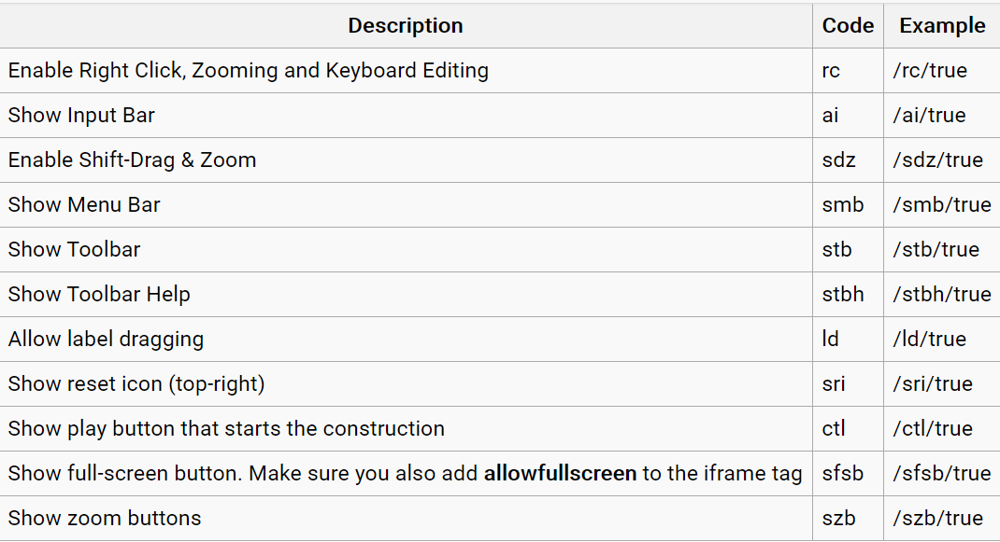

# Geogebra Tricks

We can embed live geogebra apps like this

<iframe scrolling="yes"
src="https://www.geogebra.org/material/iframe/id/mwmw6pxw/width/800/height/570/border/888888/rc/false/ai/false/sdz/false/smb/false/stb/false/stbh/true/ld/false/sri/true/at/preferhtml5"
width="500px"
height="400px"
style="border:0px;">
</iframe>

The above was inserted with this:
```html
<iframe scrolling="yes"
src="https://www.geogebra.org/material/iframe/id/mwmw6pxw/width/800/height/570/border/888888/rc/false/ai/false/sdz/false/smb/false/stb/false/stbh/true/ld/false/sri/false/at/preferhtml5"
width="500px"
height="400px"
style="border:0px;">
</iframe>
```

The following table helps us interpret the options in the long URL above to fine-tune what we embed. For example width and height modified by changing `width/800/height/570`:




Mitch McConnell (Republican leader of the Senate) today:  "President Trump is practically and morally responsible ... no question about it" 

...and so, on a technicality of my own creation, we 43 Senators will again Trump's boots and vote to acquit.  https://www.youtube.com/watch?v=QlyQdWyU2Rw
