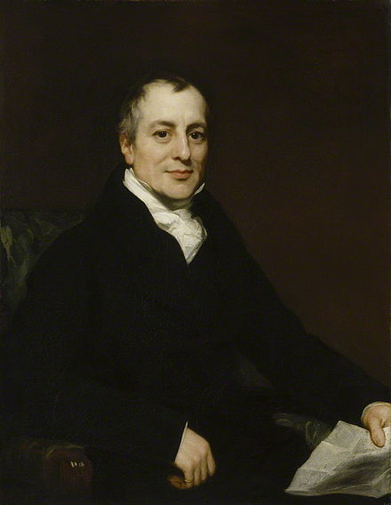

1. RMM101 The Ricardian Model is named after David Ricardo (1772-1823), considered today one of the most influential 'Classical Economists' along with Thomas Malthus, Adam Smith, and Karl Marx.  In addition to writing about Political Economy David Ricardo was also _____.

a. A wealth landlord and defender of Agrarian interests
b. A radical labor organizer
*c. A wealthy stockbroker and member of the British Parliament.
d. An English cleric

[^comment]: Image from Wikipedia 
