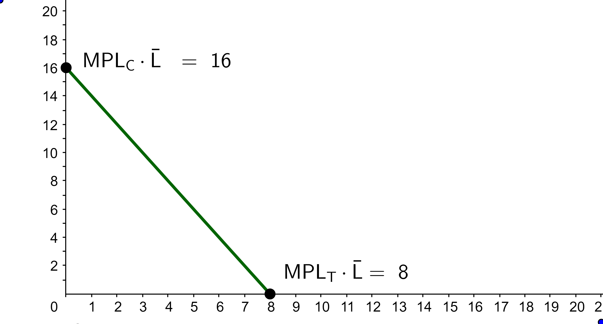

1. RMM110 Consider the PPF below, with TVs on the horizontal axis and Cars on the vertical axis. What is the no-trade relative price of cars?

a. 16 cars per television
b. 1/2 car per television
*c. 2 cars per television
d. 1 car per television

