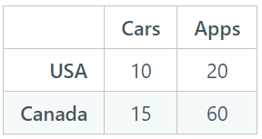

1. RMM115 The table below reports hours of labor it takes to produce each of the items. If these two countries traded based on comparative advantage, which of these would you want to be?

a. A car manufacturer in USA
*b. A car manufacturer in Canada

