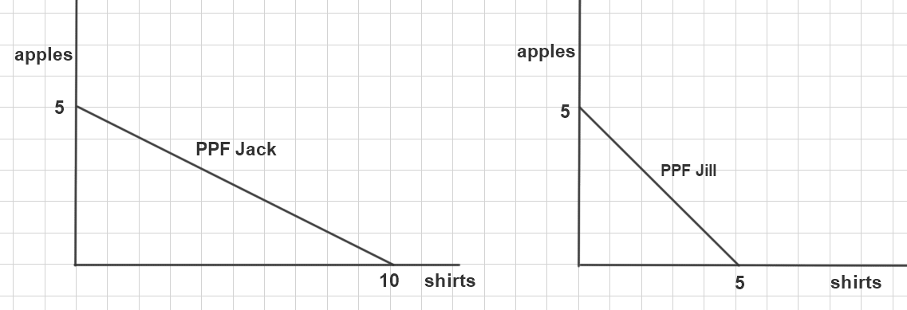

1. RMM116 Jack and Jill live on two adjacent islands. They can each produce apples and shirts. Their PPFs  is as below.  If they decide to trade with each other how will they specialize?

a. Jill will produce apples; Jack will produce shirts
*b. Jack will produce apples; Jill will produce shirts
c. They will not specialize and trade.
 
