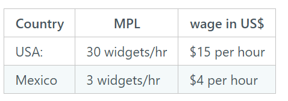

1. RMM120 Suppose you are a manufacturer of widgets considering where to locate production.  Your economists and engineers show you this table of evidence.   In which country is it cheaper to produce widgets?

a. Mexico
b. USA
C. Same cost in each country

<!-- Answer: $w \cdot \frac{1}{MPL}$
 USA:  15/30 = 0.5 per widget
 MX: 3/4 = 0.75 per widget

| Country | MPL           | wage in US\$  |
| ------- | ------------- | ------------- |
| USA:    | 30 widgets/hr | \$15 per hour |
| Mexico  | 3 widgets/hr  | \$4 per hour  |

 -->

