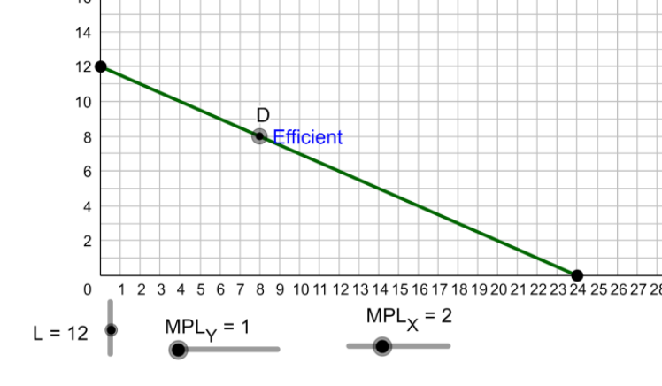

1. RMT118 Click on the efficient production point associated with an allocation that has $L_X = 8$.

Answer: Qx=16, Qy=4

[^comment]: Click on target question. First used as M01_CT_1 in TH
   We should add axis labels
