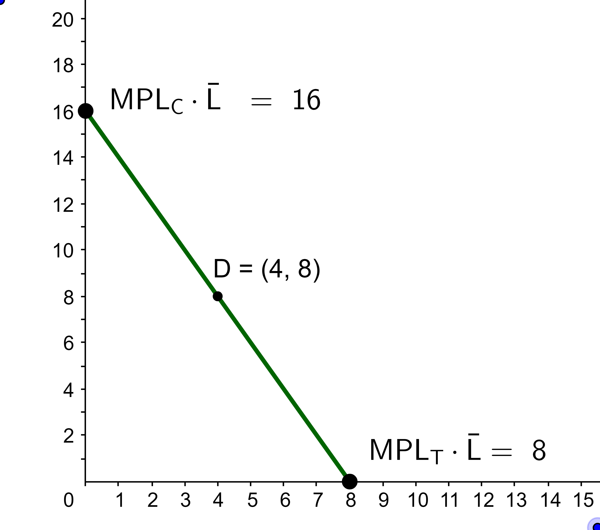

1. RMT201 Consider the economy depicted by the PPF below which produces television sets and cars. Suppose now that this closed economy opens up to trade and that the world relative price of TVs is 3 cars per TV.  Click on the production point on the PPF that maximizes national income and world prices. 

